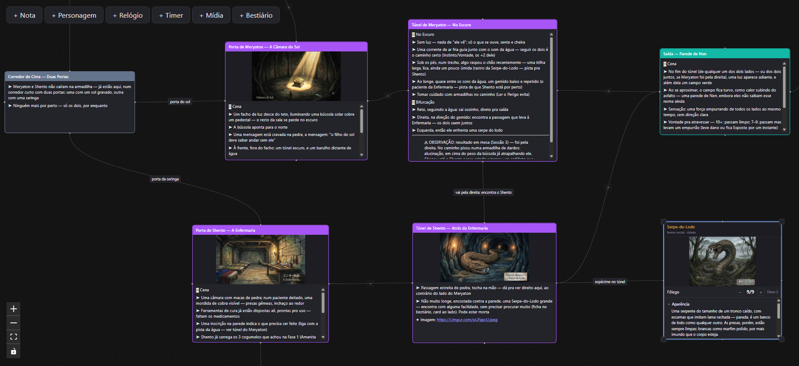
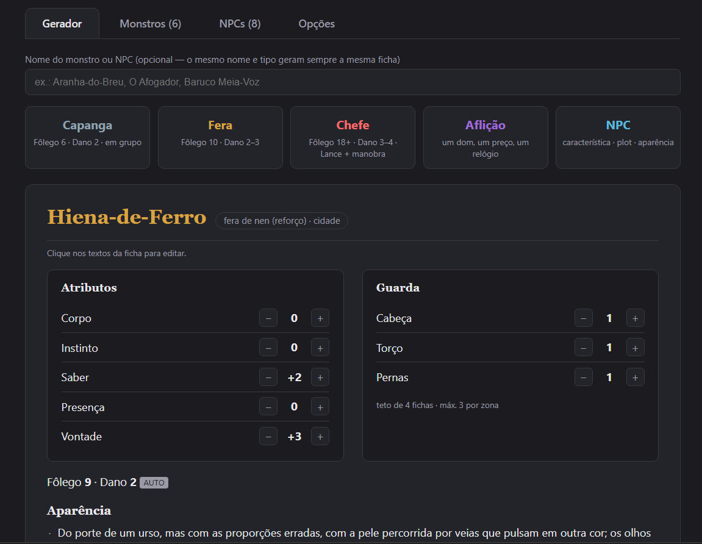
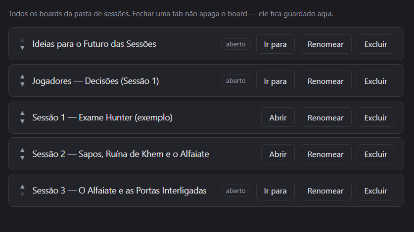

# RPG Master Plan

App desktop (Electron) de planejamento de sessões de RPG: boards de cards ligados por setas, feitos para preparar e narrar sessões. Inclui também um módulo de bestiário para gerar e gerenciar fichas de monstros e NPCs.

## Funcionalidades

### Board de sessão

Canvas infinito com cards ligados por setas para mapear cenas, NPCs, decisões e caminhos de uma sessão. Tipos de card: **Nota** (markdown com to-do lists e wiki-links `[[id]]`), **Personagem** (recursos com barras, tipo HP/Nen), **Relógio** (progresso por segmentos, estilo PbtA), **Timer** (contagem regressiva com alerta sonoro), **Mídia** (áudio/imagem) e **Bestiário** (referência viva a uma ficha do bestiário, com fôlego e guarda da cena).



### Bestiário

Gerador de fichas de monstros e NPCs com atributos, guarda, habilidades e brecha sorteados de forma determinística (mesmo nome + tipo sempre gera a mesma ficha). Abas para Monstros, NPCs e conteúdo customizável em Opções.



### Sessões

Lista de todos os boards salvos, com reordenação manual, renomear e excluir. Fechar uma aba não apaga o board — ele continua aqui, pronto pra reabrir.



## Stack

Electron + Vite + React + TypeScript, via `electron-vite`:

```
src/
  main/        processo main do Electron (janela, IPC, file system, watcher)
  preload/     contextBridge — expõe window.api pro renderer
  renderer/    app React (canvas, stores, componentes)
  shared/      tipos e utilitários usados pelos três lados
```

Ver `SPEC.md` para a especificação completa e o histórico de decisões, e `CLAUDE.md` para o schema dos dados (boards, cards, bestiário).

## Desenvolvimento

```
npm install
npm run dev      # electron-vite dev
npm run build    # tsc -b + electron-vite build
npm run lint     # oxlint
npm run dist     # build + electron-builder (executável portátil Windows)
```

## Dados

Boards e fichas de bestiário ficam fora do git, em pastas configuráveis via `settings.json` (padrão: raiz do repo) — ver `CLAUDE.md` para detalhes.
